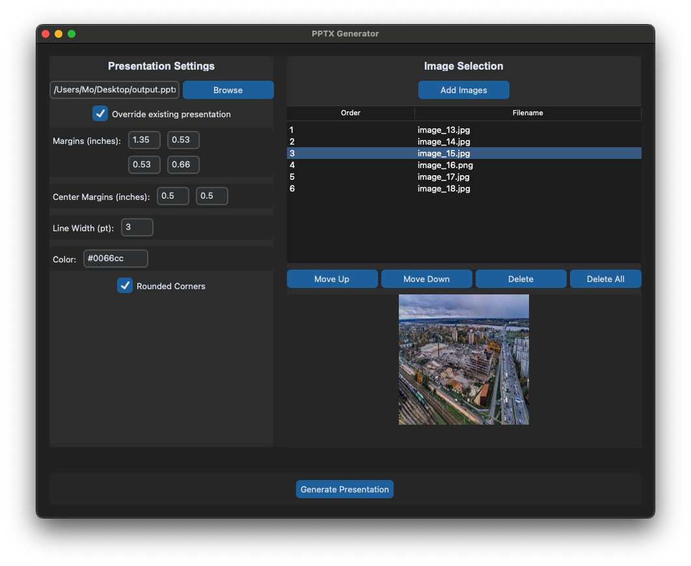

# PowerPoint Image Organizer

PowerPoint Image Organizer is a Python application that allows users to easily create PowerPoint presentations with multiple images per slide. It provides a user-friendly GUI for selecting images, arranging their order, and customizing presentation settings.




## Features

- Create new PowerPoint presentations or add to existing ones
- Add multiple images to slides with automatic layout
- Customize margins, line width, and colors
- Apply rounded corners to images
- Preview selected images
- Reorder images within slides
- Supports various image formats (PNG, JPG, JPEG)

## Installation

1. Clone the repository:

```bash
git clone https://github.com/MoAlkhateeb/powerpoint-image-organizer.git
```

2. Install the required dependencies:

```bash
pipenv install 
```

## Usage

1. Run the application:

```bash
python src/gui.py
```

1. Use the "Browse" button to select an existing presentation or enter a new filename.
2. Adjust presentation settings as needed (margins, line width, color, etc.).
3. Click "Add Images" to select the images you want to include.
4. Arrange the order of images using the "Move Up" and "Move Down" buttons.
5. Click "Generate Presentation" to create your PowerPoint file.

## Contributing
Contributions are welcome! Please feel free to submit a Pull Request.

## License
This project is licensed under the MIT License - see the LICENSE file for details.